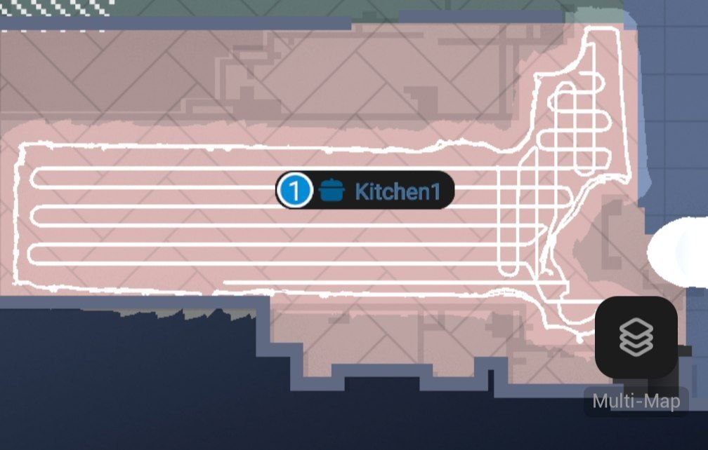

# DPS 179 — Robot Telemetry

DPS 179 is an unhandled Data Point Service that provides **high-fidelity, real-time robot telemetry**. DPS 179 fires approximately every **2 seconds** during active operations.

> [!NOTE]
> This analysis is based on payloads captured from a T2351 (X10 Pro Omni). Field patterns suggest a consolidated telemetry format designed specifically for live path tracking and session reporting.

## Message Structure

All payloads are **length-prefixed protobuf** messages. The telemetry data is typically wrapped in field 7 (positional) or field 2/11/13 (summaries).

### 1. Real-Time Position Telemetry (~28 bytes)
Broadcast every 2s while `state` is `CLEANING` or `GO_HOME`.

| Field | Type | Description |
|-------|------|-------------|
| `f7.f1` | uint32 | Unix Timestamp (seconds) |
| `f7.f2` | uint32 | Battery Level (%) |
| `f7.f4` | sint32 | **X Coordinate** (ZigZag encoded) |
| `f5.f2` | sint32 | **Y Coordinate** (ZigZag encoded) |

> [!CAUTION]
> These coordinates are **relative** and currently "blind". Without a corresponding map reference point (typically found in **DPS 165**, which hasn't been observed yet for this model), these values cannot be accurately mapped to a floor plan. They are effectively offsets from an unknown origin.

**Visual Confirmation**: Logged coordinates oscillate precisely according to the robot's horizontal zigzag pattern across rectangular rooms.

#### Sample Telemetry Log (Active Cleaning)
Captured at `08:07:01` — `08:07:09` during a Kitchen clean:

| Time | Raw Payload (Base64) | X (f7.f4) | Y (f7.f5) |
|------|----------------------|-----------|-----------|
| 01.6s | `HBIaOhgIlrujzgYQYxhiIPx9KIcOMgbO3QKg6gI=` | -8062 | 412200 |
| 03.5s | `HBIaOhgIl7ujzgYQYxhiIP19KJcOMgbk3gK+6wI=` | -8125 | 412250 |
| 05.4s | `HBIaOhgImrujzgYQYxhiIIB+KPENMgaA3gKg6gI=` | +8201 | 412416 |
| 07.5s | `HBIaOhgInLujzgYQYxhiIPV9KO0OMgay3gKI6wI=` | -8053 | 412496 |
| 09.0s | `HBIaOhgInbujzgYQYxhiIP99KO0NMgbk3gK+6wI=` | -8127 | 412573 |

*Figure 1: Observed horizontal zigzag pattern in the Eufy Clean app (T2351).*

### 2. End-of-Clean Summaries (22–107 bytes)
Sent only when the robot reaches the `CHARGING` state after completing a task.

- **Short Summary (f2)**: Contains lifetime statistics and session timestamps.
- **Detailed Summary (f11/f13)**: Contains per-room cleaning records, including durations and possibly area coverage.

#### Preliminary Correlation (Experimental)
A single simultaneous capture of DPS 167 (Standard) and DPS 179 (High-Res) suggested the following relationship. **Note: These coefficients are hypothetical and require a larger sample set for verification.**

| Metric | DPS 167 (Standard) | DPS 179 (High-Res) | Observed Ratio / Unit |
|--------|----------------|----------------|-------------------------|
| **Duration** | 1050s (17m 30s) | 1744 | **Centiminutes?**: `1744 / 100 = 17.44 min` (~17m 26s). |
| **Area** | 8 m² | 1533 | **Scale?**: `1533 / 191.6 ≈ 8 m²`. |

> [!WARNING]
> These values are based on a **sample size of 1**. The exact scaling factors and units are speculative and may vary based on map resolution, cleaning mode, or firmware version. Further captures are required to confirm the linear relationship.

---

### 3. Cleanup/Reset Payload (35 bytes)
Sent during the `DRYING` phase (docked). 
`IxIhggEeEhwKGgAAAAAAAAAAAAAAAAAAAAAAAAAAAAAAAAAA`
- Contains a sequence of null bytes.
- Likely signals the end of the telemetry session and resets the local buffer.

---
